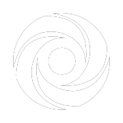
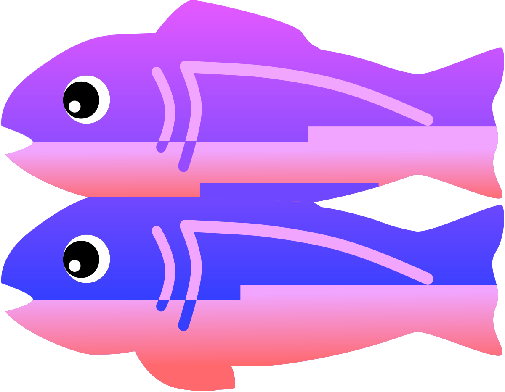

<h1 align=center>Hello World!</h1>
Hi, I'm Alden also known as AldenizenMC online. I am a 13 year old self-taught developer. I like to create random things that comes up on my mind. My favorite languages are JavaScript and TypeScript. I also sucks at creating user interface, especially in HTML & CSS

##  Languages and Tools

##  Connect with me

___

    <!-- Dark Mode -->
    
    
    <!--------------->
    <!-- Light Mode -->
    
    
    <!---------------->

